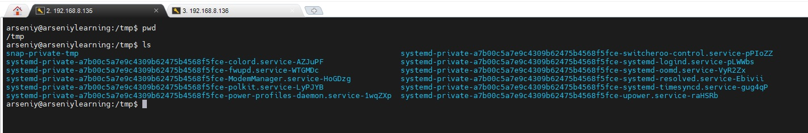
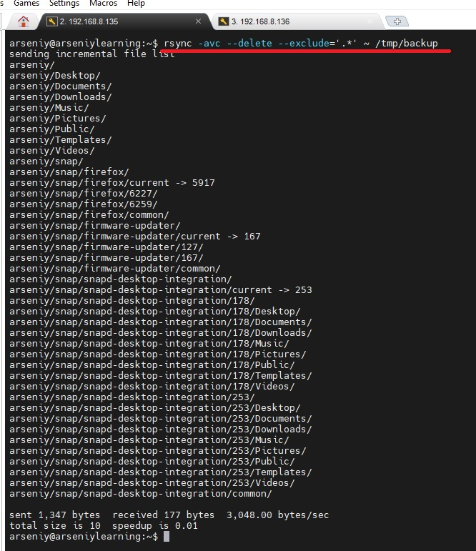
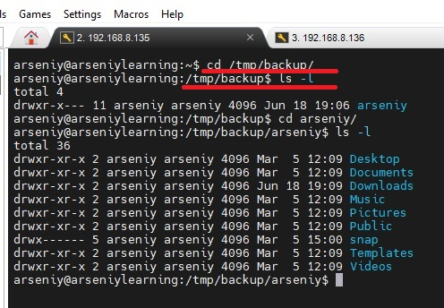
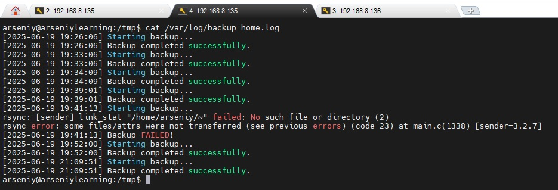
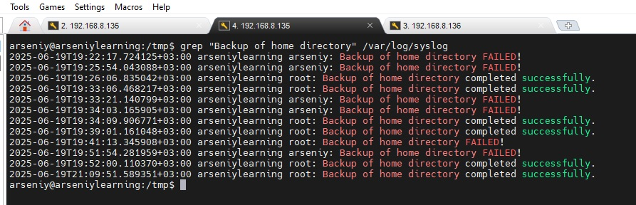
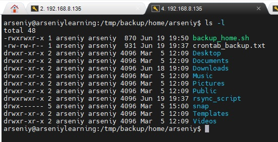
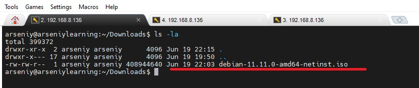
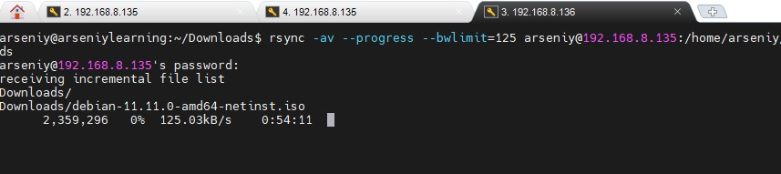

# Домашнее задание к занятию   
**"`Резервное копирование`"** - `Воскобойников Арсений Петрович`
   
**Задание 1**  
``` 
Составьте команду rsync, которая позволяет создавать зеркальную копию домашней директории пользователя в директорию /tmp/backup.
Необходимо исключить из синхронизации все директории, начинающиеся с точки (скрытые).
Необходимо сделать так, чтобы rsync подсчитывал хэш-суммы для всех файлов, даже если их время модификации и размер идентичны в источнике и приемнике.
На проверку направить скриншот с командой и результатом ее выполнения.
``` 

**Ответ**

Продемонстрирую содерживоме папки  TMP  


Выполню команду согласно заданию:  
**rsync -avc --delete --exclude='.*' ~ /tmp/backup**  
Вижу как содержимое домашней директории полностью скопировалось в папку /tmp/backup.  



**Задание 2**  

```
Написать скрипт и настроить задачу на регулярное резервное копирование домашней директории пользователя с помощью rsync и cron.
Резервная копия должна быть полностью зеркальной
Резервная копия должна создаваться раз в день, в системном логе должна появляться запись об успешном или неуспешном выполнении операции
Резервная копия размещается локально, в директории /tmp/backup
На проверку направить файл crontab и скриншот с результатом работы утилиты.
``` 
**Ответ**    
Создадим [скрипт](/conf/backup_home.sh) и положим его в кореневую директорию и сделаем исполняемым.
Добавим запуск скрипта в Crontab. Сохраним [конфиг](/conf/crontab_backup.txt) файла Crontab в домашней директории.

**crontab -l > crontab_backup.txt**

По результату выполнения операции появляется запись в логе:  

 и в системном логе согласно заданию.

(на примере оставил лог с удачным запуском и нет)  
Так же видим, что скрипт отрабатывает корректно и домашняя директоря скопирована корректно.


**Задание 3***  

```
Настройте ограничение на используемую пропускную способность rsync до 1 Мбит/c   
Проверьте настройку, синхронизируя большой файл между двумя серверами  
На проверку направьте команду и результат ее выполнения в виде скриншота  
```

**Ответ**  
Положим большой файл в папку Downloads на машине 192.168.8.135  
.

На машине 192.168.8.136 выполним команду синхронизации папок Downloads. Так же добавим прогрес бар, что бы было видно скорость загрузки файла.
Ограничим скорость загрузки до 125 килобайт/секунду ≈ 1 Мбит/с согласно заданию.

**rsync -av --progress --bwlimit=125 arseniy@192.168.8.135:/home/arseniy/Downloads /home/arseniy/Downloads**  




